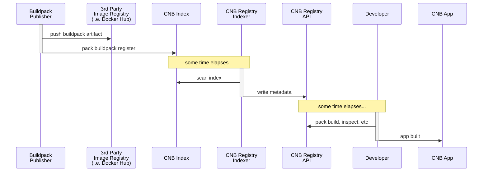
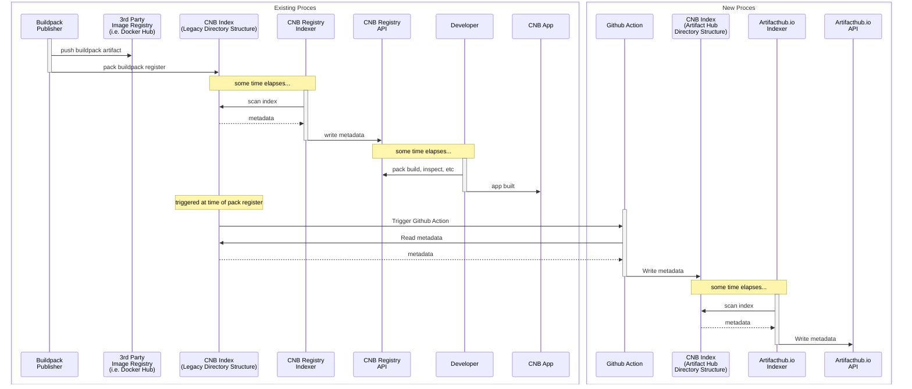
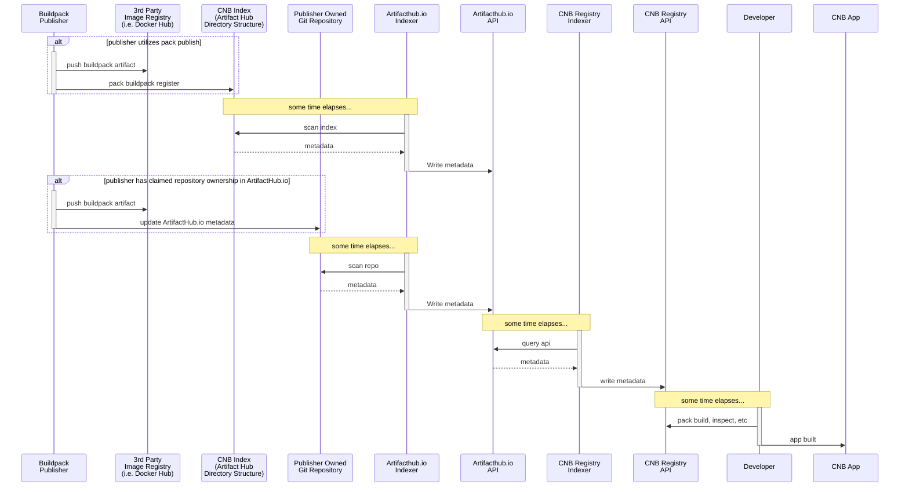
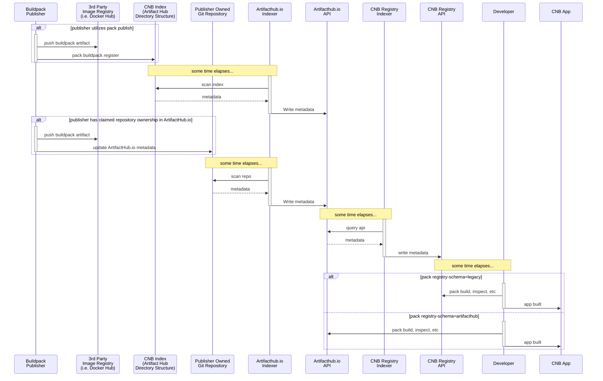
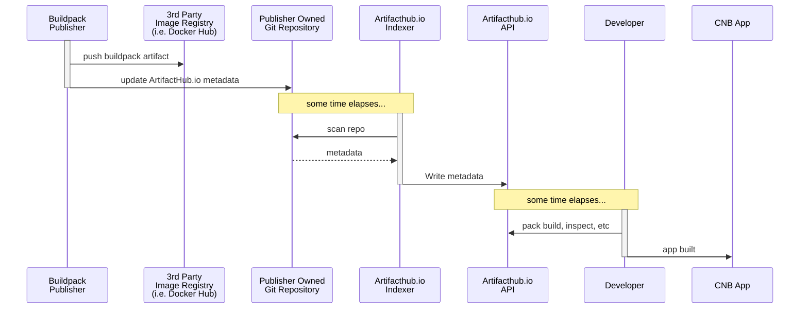

# Meta

[meta]: #meta

- Name: ArtifactHub.io Integration
- Start Date: 2024-01-16
- Author(s): @joeybrown-sf
- Status: Draft <!-- Acceptable values: Draft, Approved, On Hold, Superseded -->
- RFC Pull Request: (leave blank)
- CNB Pull Request: (leave blank)
- CNB Issue: (leave blank)
- Supersedes: (put "N/A" unless this replaces an existing RFC, then link to that RFC)

# Summary

[summary]: #summary

This RFC proposes that the Buildpacks project integrates and augments the
bespoke [registry service](https://registry.buildpacks.io/) with [ArtifactHub.io](https://artifacthub.io/) and
eventually deprecates the buildpack registry.

This RFC proposes that in 6 months, the buildpacks registry index becomes read-only. Buildpack publishers
will have 6 months to change their publish process so that buildpacks are no longer published to the registry index,
and instead buildpacks are published to ArtifactHub.io. During this time, buildpack publishers may publish to either the
buildpack registry or ArtifactHub.io. The buildpack registry will be updated such that current (and new) buildpacks in
the registry are published to ArtifactHub.io, and it will pull data only from ArtifactHub.io.

This RFC proposes to shut down the buildpacks registry index completely in 18 months. This gives time for modifications
to `pack` to read from ArtifactHub.io and for `pack` users to upgrade their `pack` version. After this time, `pack` will
read only from the [ArtifactHub.io API](https://artifacthub.io/docs/api/#/Repositories/searchRepositories).

# Definitions

[definitions]: #definitions

### [Artifact Hub](https://github.com/artifacthub/hub)

A CNCF project that is a web-based application that enables finding, installing, and publishing Cloud Native packages.

### [ArtifactHub.io](https://artifacthub.io/)

Public instance of the Artifact Hub project that is hosted with CNCF resources and maintained by Artifact Hub project
maintainers.

### [Artifact Kind](https://github.com/artifacthub/hub/blob/master/docs/repositories.md)

OCI artifacts that Artifact Hub knows about. Artifact Hub supports over 20 kinds of Cloud Native artifacts, including
Argo Templates, Backstage Plugins, Helm Charts, and others.

# Motivation

[motivation]: #motivation

Component Buildpacks and Builders should be easily discoverable to make them more usable and approachable. Today, the
[buildpacks registry](https://registry.buildpacks.io/) service is the solution to discoverability. This registry service
is a very important tool, but there is room for improvement. There are many features that ArtifactHub.io provides that
the buildpack registry does not provide. Some features include rich descriptions, usage information, activity,
dependency information, email subscriptions to packages, webhooks, related packages, and, furthermore, it is a service
that the buildpacks team does not need to maintain.

CNB should consider utilizing this project instead of enhancing its own registry. In this way, the buildpack discovery
service will benefit from more features and dedicated user experience enhancements. The CNB project can on rely on
ArticactHub for this responsibility, rather than the CNB registry bespoke solution.

Here is an [example of a helm chart](https://artifacthub.io/packages/helm/prometheus-community/prometheus) that is
indexed on ArtifactHub.io. You can see here there are a lot of interesting features like security reports,
vulnerabilities, usage stats, and all sorts of things.

# What it is

This RFC proposes changes that would affect both the Artifact Hub project and the CNB project.

### Add support in Artifact Hub for component buildpacks and builders.

Adding support in Artifact Hub is an independent operation. The Artifact Hub project could add support for buildpacks
and builders without any integration on the CNB project side. This being said, adding support without a commitment on
the CNB side could cause confusion to users because ArtifactHub.io could be interpreted as another official buildpack
registry. This could also cause additional toil for buildpack authors if they are burdened with publishing to two
indexes. Therefore, we should not do this unless we plan on migrating (in at least some capacity) to treat
ArtifactHub.io as an official buildpacks registry. This work would happen in the Artifact Hub repository. Proposal
discussion can be found [here](https://github.com/artifacthub/hub/issues/4352).

### Integrate CNB services and tools to use ArtifactHub.io as the official CNB registry

This should happen in phases so that buildpack authors and `pack` users have minimal disruption to established
workflows.

CNB is committed to backwards compatibility. Changes to the CNB registry will be backwards compatible, but if
the CNB registry is eventually completely decommissioned, current versions of pack will cease to function. This RFC
proposes a phase-out and eventual decommission of the buildpacks registry, but the existing registry _could_ exist
indefinitely while the CNB community benefits from Artifacthub.io support. This option is listed as
an [alternative](#indefinite-registry). More details of the proposed phase-out can be found in
the [migration](#migration) section of this document.

# How it Works

Component buildpacks and builders will be created as new types in Artifact Hub.

Because anyone can publish anything to ArtifactHub.io, the
CNB [Platform Team](https://github.com/buildpacks/community/blob/main/TEAMS.md#Platform-Team) can facilitate this
transition. CNB can publish all the buildpack artifacts currently indexed (and future ones) to ArtifactHub.io under a
CNB Artifact Huborganization. Publishers can then claim ownership of these artifacts and take over responsibility for
publishing can do so by [claiming ownership](https://artifacthub.io/docs/topics/repositories/#ownership-claim).

Buildpack publishers will be able to continue publishing to the buildpack registry index for a period of time, but they
will likely want to publish to ArtifactHub.io instead. Eventually, buildpack publishers will not be able to publish to
the buildpack registry.

#### Buildpack Publishing & Usage Today



# Migration

[migration]: #migration

This RFC proposes two artifact types in Artifact Hub. CNB does not have a registry for Builders, so adding support in
Artifact Hub for builders is a light lift and does not require a migration. Users will be able to discover builders via
the UI and API, but because CNB tooling does not support this kind of discoverability, there is little to do on the CNB
side.

Because CNB already has a buildpack registry, there is a necessary migration story. The following requirements
outline the necessary work. The term "requirement" is used instead of "step" because some requirements can be done in
parallel, while some have dependencies on other requirements.

### Requrement 1 - CNB Announcement

We should announce our intentions to the CNB community. There will be a slow roll-out of features but this is
ultimately a destructive change. Publishers and users will be affected. We should make this announcement so that
publishers and uers know what is coming and so that there is a reference we can direct users to in documentation and
tooling.

This announcement should be a living document that will be updated as the various requirements are satisfied.

### Requirement 2 - Approval in Artifact Hub for work to proceed

The [issue](https://github.com/artifacthub/hub/issues/4352) must be accepted in Artifact Hub. Subsequent work is
outlined in the third requirement.

### Requirement 3 - Add support in Artifact Hub for component buildpacks and builders.

The work here is in Artifact Hub. This author's understanding is that work is done mostly by Artifact Hub maintainers,
but CNB maintainers should be open and available for consulting.

> [!WARNING]
> We need to ensure the Artifact
> Hub [package metadata](https://github.com/artifacthub/hub/blob/master/docs/metadata/artifacthub-pkg.yml) suffices
> for Component Buildpacks and Builders. If not, we need to ensure we create
> adequate [custom annotations](https://artifacthub.io/docs/topics/annotations/keptn/).

### Requirement 4 - Mirror buildpack artifacts from the buildpack [registry index](https://github.com/buildpacks/registry-index) to ArtifactHub.io

_The goal here is to create a process that will register all the current (and new) buildpacks from the registry index to
ArtifactHub.io._

Establish a CNB organization in ArtifactHub.io. This organization will be the ArtifactHub.io owner for existing
buildpacks until publishers claim ownership themselves inside the ArtifactHub.io control panel.

In order to mirror the buildpack artifacts to ArtifactHub, the CNB registry index repository will set up a process and a
directory structure that contains a metadata file for each package version. For reference, please see
the [Inspektor Gadget repository structure](https://artifacthub.io/docs/topics/repositories/inspektor-gadgets/#inspektor-gadgets-repositories).

In ArtifactHub.io, anyone is able to publish any packages. The CNB registry service
will create [package metadata](https://github.com/artifacthub/hub/blob/master/docs/metadata/artifacthub-pkg.yml) for use
by Artifact Hub. These packages will be created for existing packages and any new buildpacks. Once published, buildpack
publishers can claim ownership and take over the publishing process.

The file structure in the buildpack registry index will look something like this:

```
packages
├── heroku
│   ├── dotnet
│   │   ├── 0.1.0
│   │   │   └── artifacthub-pkg.yml
│   │   │   └── readme.md
│   │   ├── 0.1.1
│   │   │   └── artifacthub-pkg.yml
│   │   │   └── readme.md
│   │   ├── 0.1.2
│   │   │   └── artifacthub-pkg.yml
│   │   │   └── readme.md
│   │   └── ...
│   ├── java
│   │   ├── 0.1.1
│   │   │   └── artifacthub-pkg.yml
│   │   │   └── readme.md
│   │   └── ...
│   └── ...
├── initializ-buildpacks
│   ├── go
│   │   ├── 1.0.0
│   │   │   └── artifacthub-pkg.yml
│   │   │   └── readme.md
│   │   ├── 1.0.1
│   │   │   └── artifacthub-pkg.yml
│   │   │   └── readme.md
│   │   ├── 1.0.2
│   │   │   └── artifacthub-pkg.yml
│   │   │   └── readme.md
│   │   └── ...
│   ├── php
│   │   ├── 1.0.0
│   │   │   └── artifacthub-pkg.yml
│   │   │   └── readme.md
│   │   └── ...
│   └── ...
├── paketo
│   ├── python
│   │   ├── 0.0.1
│   │   │   └── artifacthub-pkg.yml
│   │   │   └── readme.md
│   │   ├── 0.1.0
│   │   │   └── artifacthub-pkg.yml
│   │   │   └── readme.md
│   │   ├── 0.2.0
│   │   │   └── artifacthub-pkg.yml
│   │   │   └── readme.md
│   │   └── ...
│   ├── ruby
│   │   ├── 0.4.0
│   │   │   └── artifacthub-pkg.yml
│   │   │   └── readme.md
│   │   └── ...
│   └── ...
└── ...
```

The CNB Artifact Hub organization will register the existing buildpack packages in Artifact Hub by defining Artifact Hub
registries with URLs that point to packages in the following pattern:

- https://github.com/buildpacks/registry-index/packages/heroku/dotnet
- https://github.com/buildpacks/registry-index/packages/heroku/java
- https://github.com/buildpacks/registry-index/packages/initializ-buildpacks/go
- https://github.com/buildpacks/registry-index/packages/paketo/python
- https://github.com/buildpacks/registry-index/packages/paketo/ruby
- ...

> [!WARNING]
> At this stage, the buildpack registry API still uses the CNB registry index as its source. This means that `pack` is
> not pulling from ArtifactHub.io. Publishers should not change their publishing method at this time. There could be
> confusion if buildpack artifacts exist in ArtifactHub.io but not the registry index, because `pack` only knows about
> the packages defined in the index.


#### Processes - Mirror buildpack artifacts from the buildpack [registry index](https://github.com/buildpacks/registry-index) to ArtifactHub.io


### Requirement 5 - Update the buildpacks [registry indexer](https://github.com/buildpacks/registry-api/blob/main/cmd/index-buildpacks/main.go) to use to ArtifactHub.io instead of directly from the index file structure.

_The goal here is that the registry service no longer crawls the packages inside the buildpack index project. It will
use
ArtifactHub.io as the source of truth (ArtifactHub.io will use the registry index as its source of truth)._

At this point, ArtifactHub.io will be scanning the registry index using the new file structure outlined in the previous
step. Instead of the CNB registry service scanning this as well, the registry service will populate its database based
on calls to the ArtifactHub.io API.

When this step is complete, publishers will be able to take full owership of their publishing process. The buildpacks
registry index will continue to be read/write for 6 months, so publishers can continue to publish to the buildpacks
registry.

At this point, publishers have the option of claiming ownership of their packages and publishing to ArtifactHub.io only.
The CNB registry will read any new buildpacks that are published to ArtifactHub.io outside the CNB registry index
publishing process because it is calling the ArtifactHub.io API.

`pack` will continue reading from the CNB registry API.

At this point, publishers can publish to either the buildpack registry index or ArtifactHub.io. By the end of 6 months,
publishers should only use the ArtifactHub.io method for publishing, because the buildpack registry index will become
readonly at this point and will not accept new publishes.

#### Processes - Buildpacks registry indexer uses ArtifactHub.io as data source


### Requirement 6 - Update `pack` to pull from ArtifactHub.io

We will introduce a new flag to `pack` called `registry-schema`. The options for this flag are `cnb` and `artifacthub`.
This flag would be threaded through to all the current `pack` commands that rely on the registry, including all the
`pack buildpack` commands. If this flag is set to `artifacthub`, `pack` will utilize ArtifactHub.io. For instance, the
`pack buildpack register` command will call the ArtifactHub.io API.

From month 0-6, the flag will default to `legacy` and users will be warned about the upcoming behavior changes.

From month 6-18, the flag will default to `artifacthub`. On failures, users will be warned about the changes, and they
will be able to set the flag to `legacy` for a period of time.

After month 18, the flag will be deprecated and the only behavior will be the `artifacthub` schema behavior.

#### Processes - Pack supports both ArtifactHub.io API and CNB Registry API 


### Requirement 7 - Terminate the buildpacks registry service

From month 0-6, there will be only additive changes to the registry service. It will maintain full backwards
compatibility for 6 months.

From month 6-18, the registry service will be read-only. No buildpacks will be able to publish to the registry service
after 6 months, but it will still serve `GET` requests so that `pack` does not break.

After month 18, the registry service will be terminated. At this point, ArtifactHub.io will be the official source for
buildpacks.

#### Processes - CNB Registry is terminated


# Drawbacks

[drawbacks]: #drawbacks

This is a disruptive change for buildpack publishers. The ownership and publishing model will be different.

This is a destructive change that will affect `pack`. Any versions of `pack` that depend on the buildpack registry will
break as the various requirements of this RFC are implemented.

ArtifactHub.io will be on the hot path for some `pack` operations.

ArtifactHub.io will be on the hot path for UI discoverability.

If ArtifactHub.io goes away in the future, CNB will have to adapt. CNB discoverability and tooling could be left in a
lurch.

Between Requirements 3 and 4, the CNB artifact types will exist in ArtifactHub.io, but any packages published directly
to ArtifactHub.io will not be indexed by the buildpack registry. This could cause confusion among buildpack publishers
and `pack` users if communication about the migration is not effective.

# Alternatives

[alternatives]: #alternatives

### Do Nothing

We could leave our discoverability story alone and maintain our current implementation.

### Run our own instance of Artifact Hub

This would require time, effort, and a new investment in architecture.

### <a href="#indefinite-registry"></a> Continue to run the CNB registry indefinitely as the official source for `pack`

In this alternative, we fulfil the requirements through Requirement 5. Efforts could cease after the registry indexer
pulls sources from ArtifactHub.io. The CNB registry would continue to operate in a fully backwards-compatible manner and
there would be no necessary changes to `pack`.

# Prior Art

[prior-art]: #prior-art

Helm went through this process in 2020 when
it [replaced its registry service, Helm Hub](https://helm.sh/blog/helm-hub-moving-to-artifact-hub/). Here is Helm
Hub's [deprecation timeline](https://github.com/helm/charts#deprecation-timeline).

There are
many [repository types supported by Artifact Hub](https://github.com/artifacthub/hub/blob/master/docs/repositories.md).

# Spec. Changes

[spec-changes]: #spec-changes

Substantial changes
to [buildpack-registry](https://github.com/buildpacks/spec/blob/main/extensions/buildpack-registry.md).